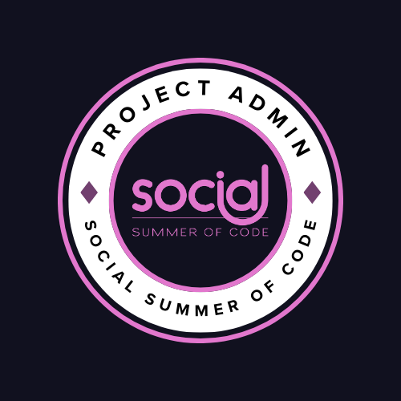

<!-- Coloured Line -->
<h3 align="center">

</h3>
<!-- Introduction Section Here -->
<h1 align="center">Hello  , I'm Sumit Gorai</h1>
<h3 align="center">A Passionate Full Stack Developer from India</h3>

  

<!-- Coloured Line -->
<h3 align="center">

</h3>

<!-- About Me Section Here -->

## <picture></picture> *About Me*

- 🔭 I’m currently working on **MERN Stack and Java Development**
  
- 🔭 I’m currently working on [Open Library Project(Using Java, Spring Boot and Angular)](https://github.com/SumitGorai01/Open_Library_using_Java_and_Angular.git) and MERN Stack project.

- 🌱 I’m currently learning **Spring Boot framework and React**

- 👯 I’m looking to collaborate on **SpringBoot Web Projects**

- 🤝 I’m looking for help with **Full-Stack development**

- 👨‍💻 All of my projects are available at [https://github.com/SumitGorai01](https://github.com/SumitGorai01)

- 💬 Ask me about **web devlopmenent , Java programming languages and MERN Stack etc**

- 📫 How to reach me **goraisumit01@gmail.com**
  
- 🌐 My Portfolio - https://sumitgorai-portfolio.netlify.app/

- 💻 My Resume - https://drive.google.com/file/d/1wDFn9oDGTWih5Y0UAEJ8tsKtvs3ktnEK/view?usp=sharing

- ⚡ Fun fact **"Why do programmers like dark mode? Because light attracts bugs."**
<!-- Coloured Line -->
<h3 align="center">

</h3>

## 💳 Github Profile View

<!--  -->

  

<!-- Coloured Line -->
<h3 align="center">

</h3>

##  &nbsp;Github Profile Trophy

    

<!-- Coloured Line -->
<h3 align="center">

</h3>

# <picture></picture> Open Source Contribution 

## Hecktoberfest Badges

<h3 align="center">

</h3>

## GSSOC(24) Badges 

   

<!-- Coloured Line -->
<h3 align="center">

</h3>

## Social Summer of Code (SSoC) & GSooC Badges  

<table>
  <tr>
    <td align="center" width="50%">
      <h3>Social Summer of Code (SSoC) Badges</h3>
      
    </td>
    <td align="center" width="50%">
      <h3>GirlScript Summer of Code (GSSoC) Badges</h3>
      
    </td>
  </tr>
</table>

## CONNECT WITH ME :
<!-- <h3 align="left">## Connect with me:</h3> -->

<!-- Coloured Line -->
<h3 align="center">

</h3>

<h3 align="left">Languages and Tools:</h3>

                             

<!-- Coloured Line -->
<h3 align="center">

</h3>

<!-- Tech Stack Section Here -->

# 💻 Tech Stack:

 
 
 
 
 
 
 
 
 

<!-- 

 
 
 -->

<!-- Coloured Line -->
<h3 align="center">

</h3>

# 📊 GitHub Stats

 

<!-- Coloured Line -->
<h3 align="center">

</h3>

<h3 align="center">

</h3>

### Made By ❤️ Sumit Gorai © Copyright. All Rights Reserved @2024.

